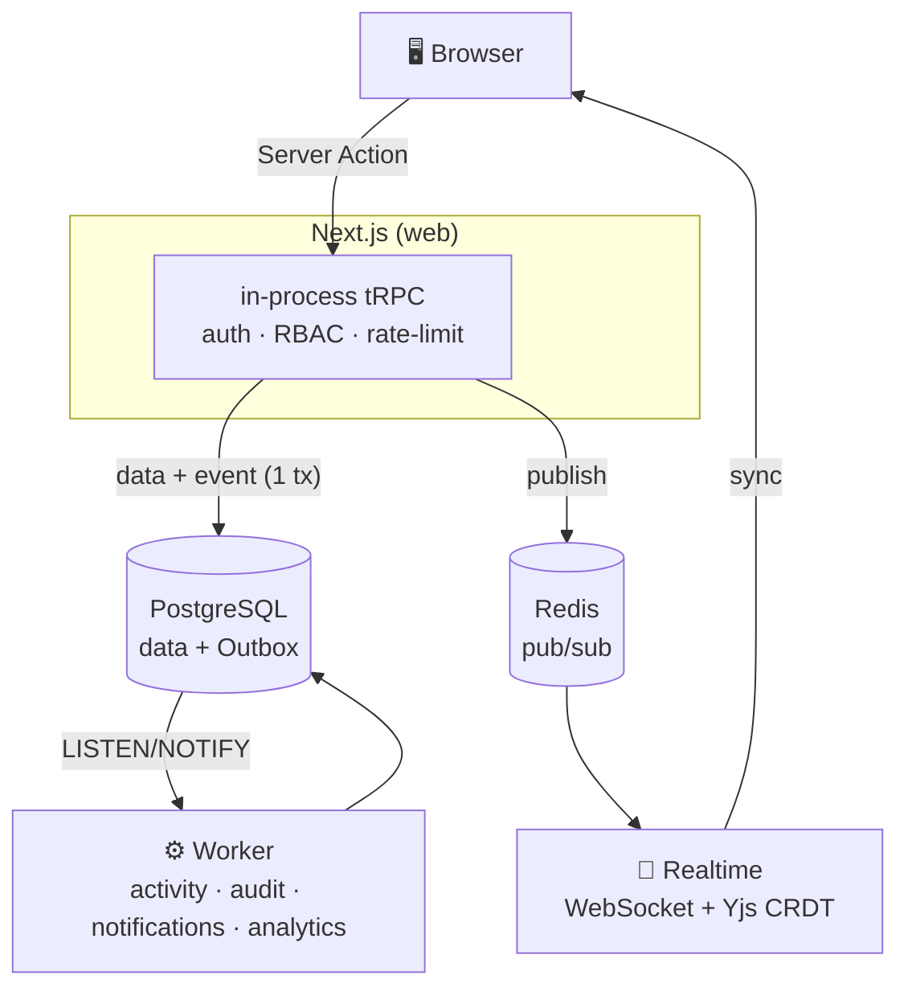
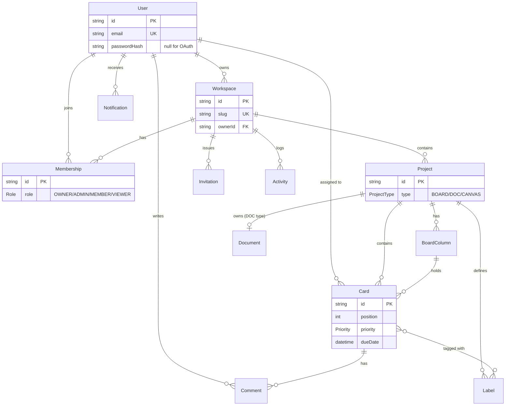

# Synapse

**Real-time collaborative work OS** — Kanban boards, collaborative docs, and a whiteboard,
all in one workspace. Think a tiny slice of Notion + Trello + Figma, built on a clean,
event-driven backbone.

> A full-stack TypeScript monorepo that deliberately stays **right-sized**: powerful where it
> matters, simple everywhere else.

---

## ✨ Features

- 🗂️ **Boards** — Kanban with drag & drop, labels, due dates, priority, assignees, comments (`@mentions`), and filters
- 📝 **Docs** — live collaborative editing (Yjs CRDT) with cursors
- 🎨 **Canvas** — shared whiteboard (tldraw), synced in real time
- 👥 **Workspaces & members** — invites, roles (Owner/Admin/Member/Viewer), RBAC
- 🔔 **Notifications · 🔎 global search · 📊 analytics · 🧾 audit log** — all fed from one event stream
- ⌘ **Command palette** (⌘K) and a personal **“My tasks”** dashboard
- 🟢 **Realtime presence** — see who else is on a board

## 🧱 Tech stack

`TypeScript` · `Next.js 15` + `React 19` · **in-process tRPC** · `Auth.js` (JWT + RBAC) ·
`PostgreSQL` + `Prisma` · `Redis` · `WebSocket` + `Yjs` · `pnpm` + `Turborepo` · `Vitest`

## 🏗️ Architecture



The interesting part isn’t how much it does — it’s how little it needs to do it:

- **No Kafka, no message broker.** A transactional **Outbox** + Postgres `LISTEN/NOTIFY` drives a
  single background **worker** that builds activity, audit, notifications and analytics — exactly-once.
- **No separate API server.** tRPC runs **in-process** inside Next.js: end-to-end type safety, no
  network hop, and no spoofable identity header (auth comes straight from the signed session).
- **3 processes, 2 containers** (Postgres + Redis). Same features, fewer moving parts.

## 🗄️ Data model

Multi-tenant by `Workspace`: every project, card and member is scoped to one. A `Project` is one of three types (`BOARD` / `DOC` / `CANVAS`) — a `DOC` project owns a single `Document` whose state is the binary Yjs CRDT snapshot. Auth.js tables (`Account`, `Session`) and the event backbone (`OutboxEvent`, `ProcessedEvent`, `AuditLog`, `DailyMetric`) sit alongside the domain model below.



> The **Outbox** (`OutboxEvent`) is written in the same transaction as the domain change; the worker relays it and records consumed `(consumer, eventId)` pairs in `ProcessedEvent` for exactly-once handling.

## 🚀 Quick start

```bash
pnpm install
cp .env.example .env
pnpm infra:up      # Postgres + Redis (Docker)
pnpm db:migrate
pnpm dev           # web :3000 · realtime :4100 · worker
```

Open <http://localhost:3000> and sign in with the seeded demo account:
`demo@synapse.dev` / `password123`.

## 📦 Layout

```
apps/      web (Next.js — hosts the tRPC API), realtime (WebSocket + Yjs)
services/  worker (Outbox → activity · audit · notifications · analytics)
packages/  db (Prisma), events, auth, env, ratelimit, config
infra/     docker-compose (Postgres + Redis)
```

## 🧪 Scripts

```bash
pnpm dev          # run everything
pnpm typecheck    # types across the monorepo
pnpm test         # unit tests (Vitest)
pnpm build        # production build
```
